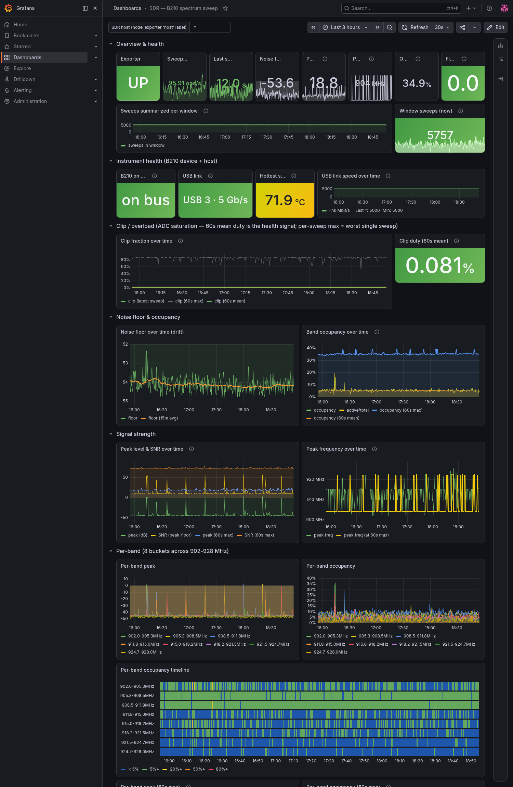
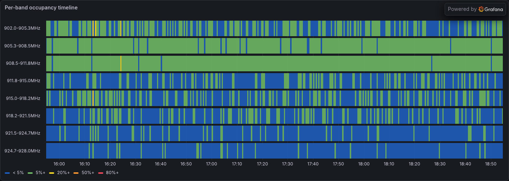

# sdr-sweep

Wideband spectrum monitoring for the **USRP B210** (UHD): sweep a frequency
range over time and find noise-floor drift, band occupancy, and
intermittent/persistent emitters. Five small tools around one shared data format
(an rtl_power-style CSV log and a JSONL stream), plus an importable Grafana
dashboard.



- **Capture** a band to a CSV log or a live JSON stream (`sdr-sweep`).
- **Watch** it live — spectrum + waterfall + stats in your terminal (`sdr-sweep-tui`).
- **Analyse** a log offline — drift, occupancy, emitter clustering → Markdown + a PNG waterfall (`sdr-sweep-report`).
- **Export** to Prometheus and chart long-term trends in Grafana (`sdr-sweep-exporter`).
- **Calibrate** RX gain empirically against the noise floor and ADC clipping (`sdr-sweep-gaincal`).

Power is **uncalibrated dB** (relative), which is exactly what drift, occupancy,
and burst detection need — they are about contrast and change, not absolute dBm.

## Install

`sdr-sweep` is a normal Python package, but **UHD is a system dependency, not a
PyPI one.** The `uhd` Python module ships with your platform's UHD install and
is only needed by the two capture commands (`sdr-sweep`, `sdr-sweep-gaincal`).

```sh
# 1) System UHD (provides the `uhd` Python module + drivers). On Debian/Ubuntu:
sudo apt install uhd-host python3-uhd
#    (or build UHD from source; make sure `python3 -c "import uhd"` works.)

# 2) The toolkit. pipx keeps it in its own environment:
pipx install "git+https://github.com/seitzbg/sdr-sweep.git"
#    optional extras: the report PNG needs matplotlib, the TUI needs rich
pipx install "sdr-sweep[all] @ git+https://github.com/seitzbg/sdr-sweep.git"
```

On the capture host, install into the **same** interpreter that can `import uhd`
(a system UHD install often lands in the system `python3`):

```sh
pip install "git+https://github.com/seitzbg/sdr-sweep.git"
```

The analysis, TUI, and exporter commands need no radio and run anywhere.

## Quickstart

Capture the 902–928 MHz ISM band for 10 minutes into a CSV log:

```sh
sdr-sweep --start 902M --stop 928M --bin 10k --gain 40 \
    --duration 600 -o ism_$(date +%F_%H%M).csv
```

Analyse it — report to stdout, waterfall PNG next to the CSV:

```sh
sdr-sweep-report ism_*.csv --relative
```

Watch a band live (capture on the SDR host, render on your laptop over SSH):

```sh
ssh sdr-host 'sdr-sweep --start 400M --stop 2.5G --stream --quiet' | sdr-sweep-tui
```

Serve Prometheus metrics for long-term Grafana trends (what the systemd service runs):

```sh
sdr-sweep --start 902M --stop 928M --stream --quiet \
    | sdr-sweep-exporter --port 9821 --bands 8
```

## The commands

| command | needs a radio | extra deps | role |
|---|---|---|---|
| `sdr-sweep` | yes (`uhd`) | numpy | capture engine: retune + stitch → CSV log and/or JSONL stream |
| `sdr-sweep-tui` | no | numpy, rich | live spectrum + waterfall + stats from the stream |
| `sdr-sweep-report` | no | numpy, matplotlib | offline analysis → Markdown report + PNG waterfall |
| `sdr-sweep-exporter` | no | stdlib only | Prometheus `/metrics` from the stream |
| `sdr-sweep-gaincal` | yes (`uhd`) | numpy | on-demand RX gain calibration → recommended gain |

Every command takes `--help` and `--version`.

## `sdr-sweep` knobs

- `--start` / `--stop` — range (accepts `902M`, `2.5G`, `915.5e6`, `10k`).
- `--bin` — target bin width (default 10 kHz). Real bin = `hop-bw / next_pow2`.
- `--hop-bw` — per-hop sample rate/bandwidth (default 20 MHz). Ranges wider than
  this are tiled with contiguous hops; narrower ranges park on one center.
- `--gain` (default 40 dB), `--ant` (default `RX2` = the board's RX1 connector).
- `--crop` — fraction of each hop's edges discarded (default 0.2) to drop the
  analog/decimation roll-off before stitching.
- `--frames` — FFT frames averaged per hop (default 16; more = smoother floor).
- `--stable-floor` — pin the AD9361 auto DC-offset/IQ-balance corrections OFF for
  a steadier floor on long drift runs (adds a static DC spike — already nulled —
  and faint mirror images of strong signals). Off by default.
- `--duration` / `--count` / `--interval` — run length and cadence.
- `-o/--output` CSV log, `--stream` JSONL to stdout, `--quiet` no stderr progress.

## Prometheus & Grafana

`sdr-sweep-exporter` serves Prometheus metrics on `:9821/metrics`: noise floor,
peak freq/level, active-bin count, per-band peak & occupancy, and a sweep
counter. See [`examples/prometheus-scrape.yml`](examples/prometheus-scrape.yml)
for a scrape job and [`examples/sdr-sweep-exporter.service`](examples/sdr-sweep-exporter.service)
for a systemd unit that runs the capture → exporter pipeline forever.

### Import the dashboard

Import [`dashboards/sdr-sweep.grafana.json`](dashboards/sdr-sweep.grafana.json)
in Grafana (Dashboards → New → Import) and pick your Prometheus datasource when
prompted (`${DS_PROMETHEUS}`). The `$host` variable filters the optional host
temperature panel by the `host` label — leave it `.*` if you don't set one.



### Latest-sweep vs windowed metrics

A parked band produces **far more sweeps than Prometheus scrapes** (a 30s scrape
can cover a hundred-plus sweeps), so the plain gauges — which describe only the
*latest* sweep — discard almost all of them. That is fine for the slow-moving
noise floor but makes bursts and ADC overloads a coin flip.

The `_max` / `_mean` series aggregate **every** sweep in a rolling `--window`
(default 60s, ~2× the scrape interval):

| latest sweep | windowed companions |
|---|---|
| `sdr_sweep_noise_floor_db` | `_mean`, `_max` |
| `sdr_sweep_peak_db` | `sdr_sweep_peak_db_max`, `sdr_sweep_peak_freq_hz_at_max` |
| `sdr_sweep_active_bins` | `sdr_sweep_active_bins_max` |
| `sdr_sweep_occupancy_ratio` | `_max`, `_mean` |
| `sdr_sweep_clip_fraction` | `_max`, `_mean` |
| `sdr_sweep_band_peak_db` | `sdr_sweep_band_peak_db_max` |
| `sdr_sweep_band_occupancy_ratio` | `_max`, `_mean` |

Use the windowed series for anything event-like — **`sdr_sweep_clip_fraction_max`
is the one to alert on for ADC overload.** `sdr_sweep_window_sweeps` reports how
many sweeps back the current aggregates; if it hits 0 on a live process, capture
has wedged without closing the pipe.

> The dashboard's "Instrument health" row (device-on-bus / USB link / host
> temperature) is driven by an optional `node_exporter` textfile collector on the
> SDR host, not by `sdr-sweep-exporter`; those tiles read "No data" without it and
> everything else works.

## Gain calibration

`sdr-sweep-gaincal` finds the optimal RX gain empirically. It sweeps gain across
the range and, at each step, measures the **noise floor** and the **ADC clip
fraction** (samples at ±full-scale — the authoritative overload test). From that
it derives:

- the **sensitivity knee** — the lowest gain that is external-noise-limited
  (floor tracks gain ~1:1); above it, detection SNR is gain-independent;
- the **overload onset** — the lowest gain where the ADC starts clipping;
- a **recommended gain** in the lower third of the clean `[knee, overload]` range.

It needs exclusive use of the radio; pass `--manage-service` to have it stop a
running exporter service for the measurement and restart it afterwards.

```sh
sdr-sweep-gaincal --manage-service            # table + recommendation
sdr-sweep-gaincal --manage-service --json | jq .recommended
```

Clip detection is bursty: a `clip = 0` reading only ever means "no overload seen
in the observed time", which the tool prints. For a definitive answer, prefer
the exporter's continuous `sdr_sweep_clip_fraction_max`, which watches every
sweep.

## Notes & caveats

- **Uncalibrated dB.** Don't read the numbers as dBm; they're relative.
- **Antenna.** UHD offers only `TX/RX` and `RX2`; the board's silkscreen "RX1"
  connector is UHD `RX2` (the default `--ant`). RX only; never transmit.
- **AD9361 floor ripple.** A ~1–2 dB periodic whole-band wobble is the chip's
  automatic DC-offset/IQ tracking calibration (UHD reports no overflows). Use
  `--stable-floor` to pin it off for long drift studies.
- **Hop seam.** With multiple hops the per-hop floors differ slightly, leaving a
  cosmetic step at hop boundaries. `sdr-sweep-report --relative` references each
  bin to its own baseline and removes it; per-bin analysis is unaffected.
- **USB.** The B210 wants a USB 3 (5 Gb/s) link; on USB 2 it enumerates but
  throughput collapses. Some hosts' xHCI controllers can wedge on hotplug and
  need a cold power drain, not a warm reboot.

## License

[MIT](LICENSE) © 2026 Bryan Seitz.
